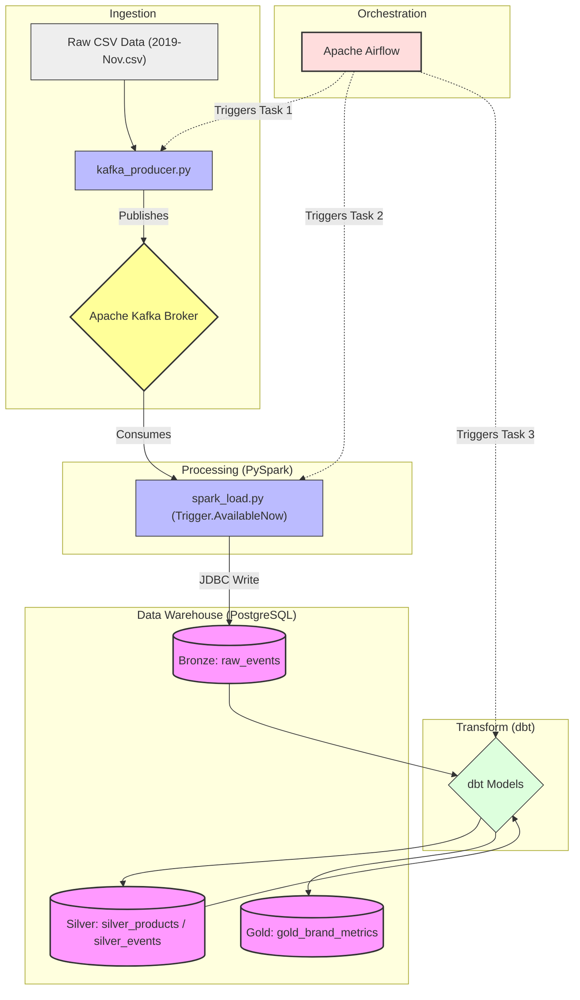

# E-Commerce Big Data Pipeline (Streaming & Batch)

An end-to-end, fully containerized Data Engineering pipeline demonstrating modern streaming and batch processing capabilities. The project ingests raw e-commerce events, streams them through Apache Kafka, processes them with Apache Spark, and builds a Medallion Architecture data warehouse in PostgreSQL using dbt. The entire workflow is orchestrated via Apache Airflow.

## Data Layers (Medallion Architecture)

### 1. Bronze (Raw Layer)

- **Table:** `raw_events`
- **Process:** A Python producer reads the massive raw `.csv` file and pushes events to a Kafka topic. Apache Spark (Structured Streaming) continuously consumes this topic and writes micro-batches directly to PostgreSQL via JDBC. Data is kept in its original, raw state.

### 2. Silver (Cleansed Layer)

- **Tables:** `silver_products`, `silver_events`
- **Process:** dbt cleans and models the data. It deduplicates product catalogs (keeping only the latest product states) and filters out invalid, incomplete, or corrupted user events to provide a reliable foundation for analytics.

### 3. Gold (Analytics Layer)

- **Table:** `gold`
- **Process:** dbt aggregates the cleaned data to create business-critical reporting. This layer includes comprehensive brand metrics (e.g., total views, conversion rates, revenues) enabling direct business intelligence insights.

## Tech Stack

This project utilizes a modern, open-source data stack designed for scalability, stream processing, and full automation.

- **Infrastructure:** [Docker](https://www.docker.com/) & [Docker Compose](https://docs.docker.com/compose/) with custom image builds.
- **Message Broker:** [Apache Kafka](https://kafka.apache.org/) for real-time event streaming.
- **Data Processing:** [Apache Spark (PySpark)](https://spark.apache.org/docs/latest/api/python/index.html) for scalable, fault-tolerant structured streaming.
- **Data Warehouse:** [PostgreSQL](https://www.postgresql.org/) serving as the centralized relational storage.
- **Transformation:** [dbt (data build tool)](https://www.getdbt.com/) for SQL-based modeling and ELT processes.
- **Orchestration:** [Apache Airflow](https://airflow.apache.org/) for workflow automation, task dependencies, and pipeline monitoring.

## Architecture

Getting Started

Follow these steps to replicate the isolated containerized environment and run the pipeline locally.

**1. Prerequisites**

- Docker Desktop installed and running.

- The raw data file (2019-Nov.csv) placed inside the ./data directory.

**2. Start the Infrastructure**
Spin up the entire stack (PostgreSQL, Kafka, Spark, and custom Airflow image). The --build flag is required to build the custom Airflow image containing necessary dependencies.

_docker-compose up -d --build_

**3. Access Airflow & Retrieve Password**
During the first startup, Airflow generates a secure standalone admin password. Retrieve it by opening a new terminal tab and running:

_docker exec airflow_standalone cat /opt/airflow/standalone_admin_password.txt_

Log in to the Airflow UI:

Navigate to http://localhost:8085 in your browser.

Username: admin

Password: (paste the retrieved password string)

**4. Run the Pipeline**
The entire pipeline is now fully automated. Airflow will sequentially run the Kafka Producer, trigger Spark to consume the data, and finally run the dbt transformations.

In the Airflow UI, locate the ecommerce_big_data_pipeline DAG.

Toggle the switch on the left to unpause the DAG.

In the Actions column on the right, click the Play button and select Trigger DAG.

Navigate to the Graph view to monitor the progress in real-time.

**6. View Results**
Once all Airflow tasks complete successfully, connect to the PostgreSQL database via a SQL client (e.g., pgAdmin or DBeaver) using the credentials defined in docker-compose.yml (localhost:5432, user: admin, pass: admin). Query the gold table to view the final analytical reporting data.

Cleanup
To safely shut down and remove all containers, networks, and images created by this project, run:

_docker-compose down_
